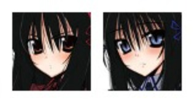
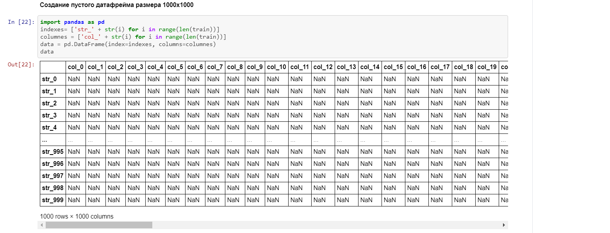
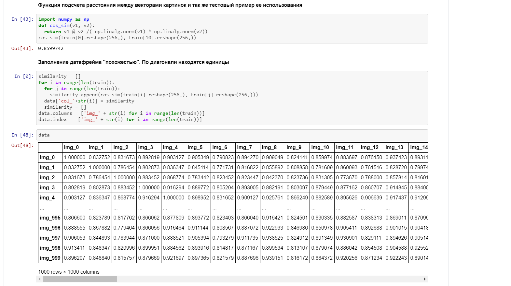
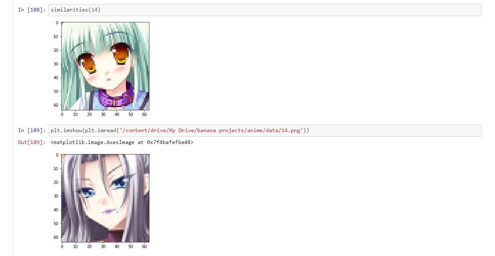
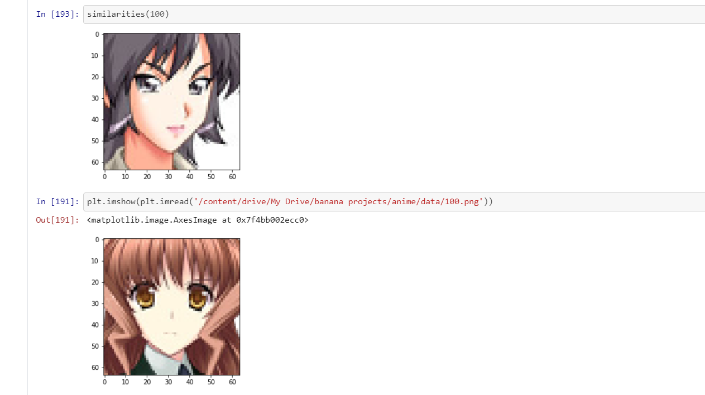

This is my **Image preprocessing and encoding baseline, based on [Keras](https://keras.io/)**. 
I'm using `Python 3.6`.
# Contents

[***Objective***](https://github.com/DmitryIo/animefaces#objective)

[***Concepts***](https://github.com/DmitryIo/animefaces#concepts)

[***Implementation***](https://github.com/DmitryIo/animefaces#implementation)

[***Results***](https://github.com/DmitryIo/animefaces#results)

# Objective

**To build a model that can convert pixel images into array of numbers**

My main goal was creating a programm which would be able to preprocess and work with images. At that time i was watching some Japaneese cartoons, and that is why i decided to make a project connected to machine learning problem. How can computer work with such images?

It is easy to see similarity for human between these photos. But how can a computer solve this problem?

# Concepts

**Encoder**

For this task i have implemented machine learning architecture, which is called 'Encoder&Decoder architecture'
Typically, a model that generates arrays will use an Encoder to encode the input into a fixed form and a Decoder to decode it, pixel by pixel, into an array.

`How it works:`

**Decoder**

Decoder is used just for training encoder and for my task i dont use it more.

# Implementation

**Dataset**

For this task i have found [Kaggle](https://www.kaggle.com/) dataset. The link to download it - https://drive.google.com/file/d/10DAA6GOT6K9I7w0ibYnt_HzNPac03s6b/view?usp=sharing

It contains 100.000 pixel images 64x64. The kind of it you could see at [Objective](https://github.com/DmitryIo/animefaces#objective)

**Coding**

First of all we need to upload our data and make understandable view for Keras of it. We have `ImageDataGenerator` which will help us to enlarge our data and make more samples for our training set. Here is an example of how it works:

If we have a start image(at the example it is in blue circle), the DataGenerator will generate some another images, which will be like the first one.

This is the implementation in my code:

We create template for generator `train_datagen` and then we read the images in `train_generator` setting the batch size.

The next step is the creating the autoencoder which in my code is described in function `create_deep_conv_ae`.

The main idea here is to create layers which take `(64, 64, 3)` shape and then return `(8, 8, 3)` shape image. Here are two models: encoder and decoder. 

Here is described the process of teaching model.

After learning parameters we can pass through encoder images and get vector represantation of it:

At this moment we create an empty DataFrame in which we will save the similarity in future.

Now we can put all the similarities in our DataFrame! There are 1.0 at the diagonals. This is a sign of the thing that all passed correctly.

This is the final function which shows the most similar photo by the given one.

Examples of how it works:

This is the 10th photo and the most similar to 10th photo.

This is the 14th photo and the most similar to 14th photo.

This is the 100th photo and the most similar to 100th photo(the mimics)

Full process of coding described in my [Notebook](autoencoder.ipynb) `All comments are Russian there`

# Results

The result of my work is: 

 **1) I have learned how to use autoencoder and decoder to process images**
 
 **2) Now i can work with all these arrays of images like i want to. And there is my next project, in which i have used all this stuff [Project](https://github.com/DmitryIo/animebot)**
 
Thank you for attention!
